# Video Summarization API

A FastAPI service that accepts a video upload and produces a concise summarized
video with AI-generated narration.

## Architecture

```mermaid
flowchart LR
    Upload["🎬 Video Upload"]

    subgraph Transcription["1. Transcription"]
        direction TB
        T1["WhisperX (local)"]
        T2["OpenAI Whisper API"]
    end

    subgraph Summarization["2. Summarization"]
        direction TB
        S1["Ollama (local)"]
        S2["OpenAI GPT-4o"]
        S3["Google Gemini"]
    end

    subgraph TTS["3. Text-to-Speech"]
        direction TB
        TTS1["gTTS (local)"]
        TTS2["FPT.AI Cloud"]
    end

    Compose["🎥 MoviePy Compose"]
    Output["✅ Summarized Video"]

    Upload --> Transcription --> Summarization --> TTS --> Compose --> Output
```



### Provider Matrix

| Stage | `env` value | Provider | Requirements |
|-------|------------|----------|-------|
| Transcription | `local` | WhisperX | GPU recommended, auto CPU fallback |
| Transcription | `openai` | OpenAI Whisper API | `OPENAI_API_KEY` |
| Summarization | `local` | Ollama (Llama 3, etc.) | Local Ollama server |
| Summarization | `openai` | OpenAI GPT-4o | `OPENAI_API_KEY` |
| Summarization | `gemini` | Google Gemini | `GEMINI_API_KEY` |
| TTS | `local` | gTTS (Google Text-to-Speech) | Internet connection |
| TTS | `cloud` | FPT.AI TTS | `FPT_API_KEY` |

### Design Patterns

- **Strategy** — each pipeline stage (transcription, summarization, TTS) has an abstract interface; concrete adapters are swappable at runtime
- **Adapter** — wraps third-party SDKs (OpenAI, Gemini, WhisperX, gTTS) behind our standard interfaces
- **Factory Method** — `ComponentFactory` maps the `env` string to the correct adapter, centralizing creation logic
- **Repository** — `TaskRepository` abstracts PostgreSQL persistence
- **Pipeline** — `VideoSummarizationPipeline` orchestrates the full workflow

## Prerequisites

- Python 3.11+
- FFmpeg installed and on `PATH`
- **PostgreSQL 14+** running locally (or via Docker)
- **At least one provider** per stage:
  - Transcription: WhisperX locally **or** OpenAI API key
  - Summarization: Ollama locally **or** OpenAI / Gemini API key
- NVIDIA GPU + CUDA (optional — auto-falls back to CPU)

## Quick Start

```bash
# 1. Clone and enter
git clone <repo-url>
cd video-summarization-api

# 2. Create virtual environment
python -m venv venv
venv\Scripts\activate        # Windows
# source venv/bin/activate   # Linux/macOS

# 3. Install dependencies
pip install -r requirements.txt

# 4. Configure environment
copy .env.example .env       # Windows
# cp .env.example .env       # Linux/macOS
# Edit .env with your DATABASE_URL and other settings

# 5. Set up the database
# Option A: Let the app auto-create tables on first start
python main.py

# Option B: Use Alembic migrations (recommended for production)
alembic upgrade head
python main.py
```

## Database Setup

### Using Docker (easiest)

```bash
docker run -d \
  --name vsapi-postgres \
  -e POSTGRES_USER=postgres \
  -e POSTGRES_PASSWORD=postgres \
  -e POSTGRES_DB=video_summarization \
  -p 5432:5432 \
  postgres:16-alpine
```

### Using a local PostgreSQL installation

```sql
CREATE DATABASE video_summarization;
```

Then update `DATABASE_URL` in your `.env` file.

### Alembic Migrations

```bash
# Apply all migrations
alembic upgrade head

# Create a new migration after model changes
alembic revision --autogenerate -m "describe your change"

# Roll back the last migration
alembic downgrade -1
```

The API will be available at `http://localhost:8000`.
Interactive docs at `http://localhost:8000/docs`.

## API Endpoints

| Method | Path | Description |
|--------|------|-------------|
| `GET` | `/health` | Health check (includes DB status) |
| `POST` | `/api/v1/summarize` | Upload video & start pipeline |
| `GET` | `/api/v1/tasks/{id}` | Check task status |
| `GET` | `/api/v1/tasks/{id}/download` | Download result |

### Upload — Local Pipeline

```bash
curl -X POST http://localhost:8000/api/v1/summarize \
  -F "file=@my_video.mp4" \
  -G -d "language=vi" -d "tts_env=local"
```

### Upload — Cloud Pipeline (OpenAI transcription + Gemini summarization)

```bash
curl -X POST http://localhost:8000/api/v1/summarize \
  -F "file=@my_video.mp4" \
  -G -d "transcriber_env=openai" \
     -d "summarizer_env=gemini" \
     -d "tts_env=local" \
     -d "language=en"
```

### Upload — Mixed (local transcription + OpenAI summarization)

```bash
curl -X POST http://localhost:8000/api/v1/summarize \
  -F "file=@my_video.mp4" \
  -G -d "transcriber_env=local" \
     -d "summarizer_env=openai" \
     -d "tts_env=local" \
     -d "language=vi"
```

### Check Status

```bash
curl http://localhost:8000/api/v1/tasks/<task-id>
```

### Download Result

```bash
curl -O http://localhost:8000/api/v1/tasks/<task-id>/download
```

## Configuration

All settings are read from environment variables (or `.env` file).
See [`.env.example`](.env.example) for the full list.

## Project Structure

```
├── main.py                        # Entry point (uvicorn launcher)
├── requirements.txt
├── alembic.ini                    # Alembic configuration
├── .env.example
├── alembic/
│   ├── env.py                     # Async migration environment
│   ├── script.py.mako             # Migration template
│   └── versions/
│       └── 001_create_tasks_table.py
├── app/
│   ├── api/
│   │   ├── app.py                 # FastAPI factory, lifespan, shared state
│   │   └── endpoints/
│   │       ├── system.py          # GET /health
│   │       ├── summarization.py   # POST /api/v1/summarize + background worker
│   │       └── tasks.py           # GET status + GET download
│   ├── core/
│   │   ├── config.py              # Pydantic settings (incl. DATABASE_URL)
│   │   └── logging.py             # Logging setup
│   ├── db/
│   │   ├── models.py              # SQLAlchemy ORM models
│   │   └── session.py             # Async engine & session factory
│   ├── models/
│   │   └── schemas.py             # Pydantic request / response models
│   ├── patterns/
│   │   ├── interfaces.py          # Abstract strategies (ABC)
│   │   ├── factory.py             # Component factory
│   │   └── adapters/
│   │       ├── prompts.py         # Shared prompt builder
│   │       ├── transcription.py   # WhisperX + OpenAI Whisper
│   │       ├── summarization.py   # Ollama + OpenAI GPT + Gemini
│   │       └── tts.py             # gTTS + FPT Cloud
│   └── services/
│       ├── pipeline.py            # Orchestration pipeline
│       └── task_store.py          # TaskRepository (PostgreSQL)
├── uploads/                       # Uploaded videos (gitignored)
└── outputs/                       # Summarized videos (gitignored)
```

## License

MIT
